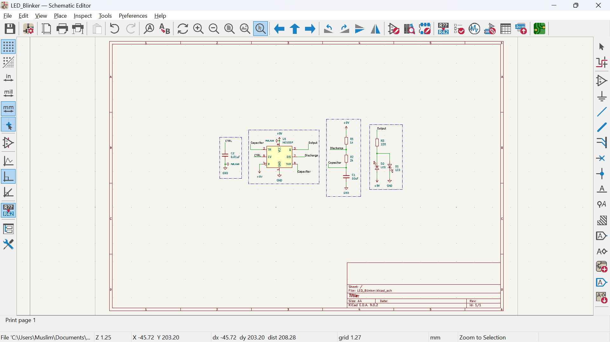
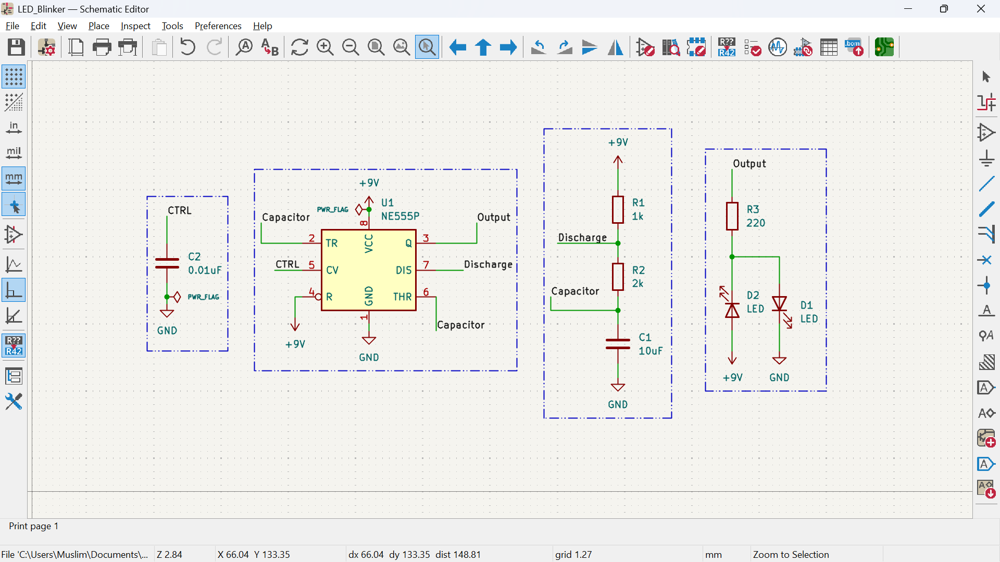
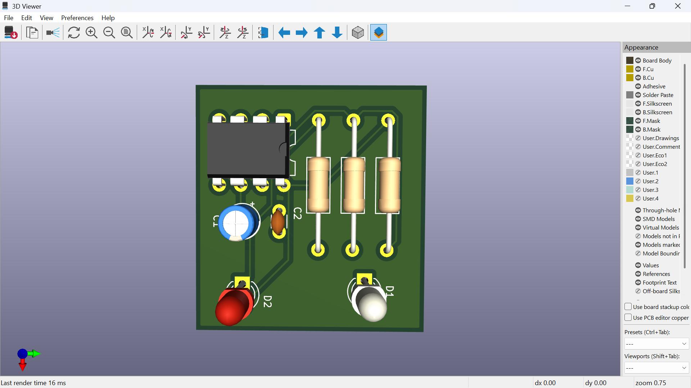
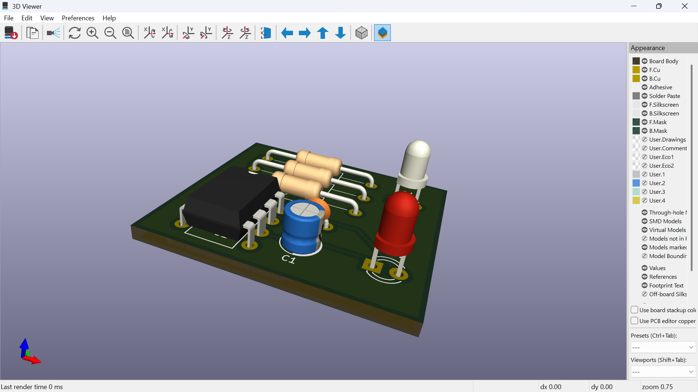
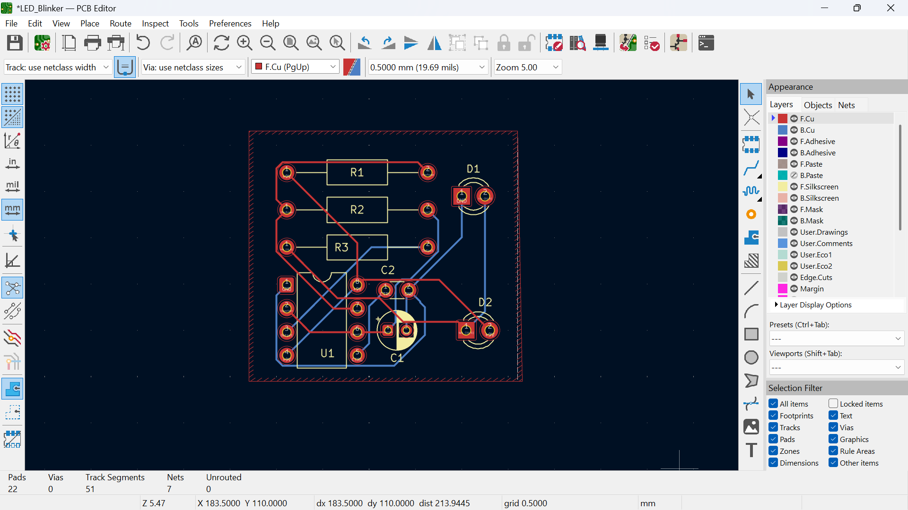
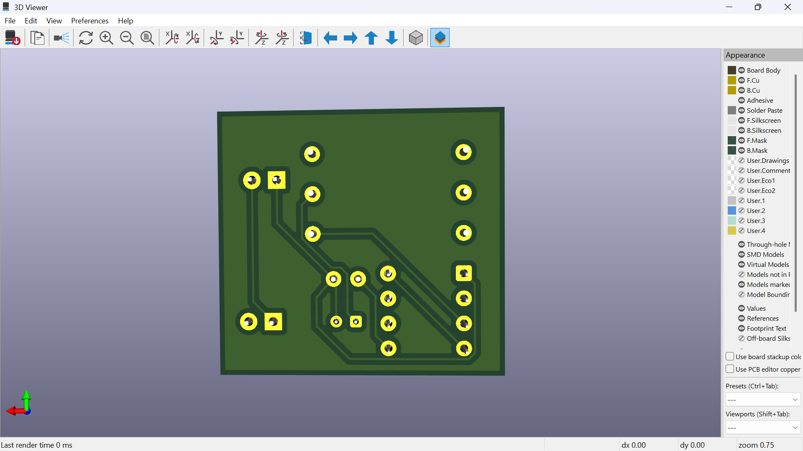

# LED Blinker PCB Project

This is a simple LED blinking circuit I designed as a PCB using **KiCad** and simulated using **Falstad**.

## 🧠 Purpose
To learn:
- Basic electronic design principles
- PCB design with KiCad
- Circuit simulation using Falstad

## ⚡ Circuit Overview
A basic 555 timer-based (or microcontroller-based) LED blinking circuit.

## 🧰 Tools Used
- [KiCad](https://www.kicad.org/) for schematic and PCB design
- [Falstad](https://www.falstad.com/circuit/) for simulation

## 🔗 Falstad Simulation
Click to open the circuit in Falstad:  
👉 [Open LED Blinker Simulation](https://tinyurl.com/ymw78zgp)

You can simulate, tweak, and interact with the circuit live in your browser.

## 📂 Files Included
- `KiCad/`: Full KiCad project files
- `falstad/`: Falstad simulation export
- `images/`: Screenshots of schematic and PCB
  
## 🏁 Next Steps
- Test and debug the real circuit
- Improve the design with features (button input, variable blink rate)

---

## ❤️ Author
This is my first PCB project. Even though it's a small one, it's a huge step in learning electronics!

